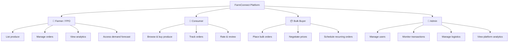
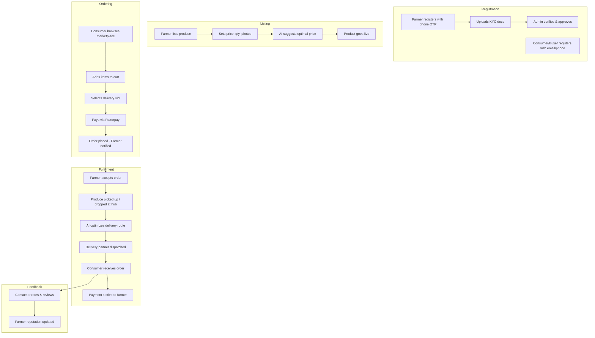
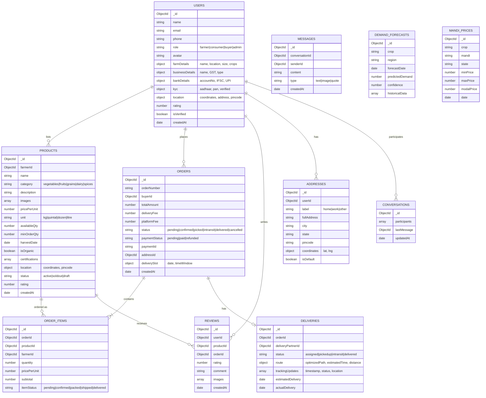

# FarmConnect — Digital Farmer-to-Consumer Marketplace

A full-stack digital marketplace that eliminates intermediaries by connecting farmers and FPOs directly with consumers and bulk buyers, with AI-powered demand forecasting, route optimization, and integrated logistics.

---

## Problem Statement

Multiple intermediaries in the agricultural supply chain reduce farmers' earnings by 40-60% and inflate consumer prices. Farmers lack direct market access, demand visibility, and affordable logistics — leading to massive inefficiency and food wastage.

## Proposed Solution — FarmConnect

A Next.js web application with four user roles, AI intelligence, and logistics integration that creates a transparent, efficient, and fair agricultural marketplace.

---

## Tech Stack

| Layer | Technology | Why |
|---|---|---|
| **Frontend** | Next.js 14 (App Router) + Tailwind CSS + shadcn/ui | SSR, SEO, fast dev, great DX |
| **Backend** | Next.js API Routes (Route Handlers) | Unified codebase, serverless-ready |
| **Database** | MongoDB Atlas (Mongoose ODM) | Flexible schema for products, orders |
| **Auth** | NextAuth.js v5 (credentials + OTP) | Multi-role auth, session management |
| **AI/ML** | Python microservice (FastAPI) | Demand forecasting, route optimization |
| **Maps & Routing** | Google Maps API / Mapbox | Route optimization, distance calc |
| **Payments** | Razorpay | UPI, cards, net banking (India-focused) |
| **File Storage** | Cloudinary | Product images, documents |
| **Real-time** | Socket.io or Pusher | Order tracking, notifications |
| **SMS/OTP** | Twilio or MSG91 | Phone-based auth for farmers |
| **Deployment** | Vercel (frontend) + Railway/Render (AI service) | Easy CI/CD |
| **Language** | TypeScript throughout | Type safety |

---

## User Roles & Permissions



| Role | Description |
|---|---|
| **Farmer/FPO** | Lists produce, sets prices, manages inventory, views demand forecasts, receives orders |
| **Consumer** | Browses produce, places orders, tracks delivery, rates sellers |
| **Bulk Buyer** | Restaurants, retailers, exporters — places large orders, negotiates, schedules recurring purchases |
| **Admin** | Platform management, user verification, dispute resolution, analytics dashboard |

---

## Core Features

### 1. 🌾 Farmer/FPO Dashboard
- **Product Listing**: Add produce with photos, quantity, price/kg, harvest date, organic certification
- **Inventory Management**: Real-time stock tracking, low-stock alerts
- **Order Management**: View incoming orders, accept/reject, update status
- **AI Demand Forecast**: See predicted demand for their produce in nearby regions
- **Earnings Dashboard**: Revenue analytics, payment history, pending settlements
- **Mandi Price Comparison**: Live mandi (market) prices to help set competitive rates
- **FPO Group Selling**: Multiple farmers pool produce under one FPO listing

### 2. 🛒 Consumer Interface
- **Product Discovery**: Search, filter by category/location/price/organic, sort by freshness
- **Farm Profiles**: View farmer/FPO details, certifications, ratings
- **Cart & Checkout**: Multi-seller cart, address management, payment via Razorpay
- **Order Tracking**: Real-time delivery status with map view
- **Subscription Boxes**: Weekly/monthly recurring orders for essentials
- **Reviews & Ratings**: Rate produce quality and seller reliability

### 3. 📦 Bulk Buyer Portal
- **Bulk Order Placement**: Large quantity orders with volume discounts
- **Price Negotiation**: Request-for-quote system between buyer and farmer
- **Recurring Orders**: Schedule weekly/monthly auto-orders
- **Invoice Management**: GST-compliant invoices, bulk payment processing
- **Quality Assurance**: Specify quality grades, get certified produce

### 4. 🚚 Logistics & Delivery
- **AI Route Optimization**: Optimal delivery routes combining multiple orders
- **Delivery Partner Integration**: Assign local delivery partners or self-pickup
- **Cold Chain Tracking**: Temperature monitoring for perishables (IoT-ready)
- **Delivery Slot Selection**: Consumers pick preferred delivery windows
- **Hub-and-Spoke Model**: Regional collection centers aggregate produce before dispatch

### 5. 🤖 AI Intelligence Engine (Python Microservice)
- **Demand Forecasting**: Predict demand by region, crop, and season using historical data
- **Dynamic Pricing Suggestions**: Recommend prices based on supply/demand, mandi rates
- **Route Optimization**: Calculate optimal multi-stop delivery routes
- **Crop Recommendation**: Suggest what to grow based on upcoming demand trends
- **Wastage Prediction**: Alert when perishable inventory is at risk

### 6. 🔧 Admin Panel
- **User Management**: Verify farmers/FPOs, manage bans, KYC verification
- **Transaction Monitoring**: Track all orders, payments, disputes
- **Platform Analytics**: GMV, active users, top products, regional heatmaps
- **Content Management**: Banners, announcements, featured farmers
- **Logistics Management**: Assign delivery partners, manage hubs
- **Dispute Resolution**: Handle order complaints, refunds

---

## Application Workflow



---

## Page Structure & Routes

### Public Pages
| Route | Page | Description |
|---|---|---|
| `/` | Landing Page | Hero, how-it-works, featured produce, farmer stories, stats |
| `/marketplace` | Marketplace | Browse all produce with filters, search, categories |
| `/marketplace/[productId]` | Product Detail | Full product info, farmer profile, reviews, add-to-cart |
| `/farmer/[farmerId]` | Farmer Profile | Public profile, all listings, ratings, certifications |
| `/about` | About Us | Mission, team, impact metrics |
| `/how-it-works` | How It Works | Step-by-step guide for farmers and buyers |
| `/contact` | Contact | Support form, FAQ |
| `/auth/login` | Login | Email/phone + OTP login |
| `/auth/register` | Register | Role-based registration (farmer/consumer/buyer) |
| `/auth/register/farmer` | Farmer Registration | Detailed farmer/FPO onboarding with KYC |

### Farmer Dashboard (`/dashboard/farmer/...`)
| Route | Page | Description |
|---|---|---|
| `/dashboard/farmer` | Overview | Stats summary, recent orders, alerts |
| `/dashboard/farmer/products` | My Products | List, edit, delete produce listings |
| `/dashboard/farmer/products/new` | Add Product | Create new listing with AI price suggestion |
| `/dashboard/farmer/orders` | Orders | Incoming orders, accept/reject, status updates |
| `/dashboard/farmer/orders/[orderId]` | Order Detail | Full order details with buyer info |
| `/dashboard/farmer/analytics` | Analytics | Revenue, sales trends, demand forecast |
| `/dashboard/farmer/earnings` | Earnings | Payment history, pending settlements, withdrawals |
| `/dashboard/farmer/profile` | Profile Settings | Edit farm details, bank info, certifications |
| `/dashboard/farmer/mandi-prices` | Mandi Prices | Live market prices comparison |

### Consumer Dashboard (`/dashboard/consumer/...`)
| Route | Page | Description |
|---|---|---|
| `/dashboard/consumer` | Overview | Recent orders, saved items, recommendations |
| `/dashboard/consumer/orders` | My Orders | Order history with status tracking |
| `/dashboard/consumer/orders/[orderId]` | Order Detail | Detailed tracking with map, delivery updates |
| `/dashboard/consumer/addresses` | Addresses | Manage delivery addresses |
| `/dashboard/consumer/subscriptions` | Subscriptions | Manage recurring produce boxes |
| `/dashboard/consumer/profile` | Profile | Account settings |

### Bulk Buyer Dashboard (`/dashboard/buyer/...`)
| Route | Page | Description |
|---|---|---|
| `/dashboard/buyer` | Overview | Active orders, quotes, spend summary |
| `/dashboard/buyer/orders` | Orders | Bulk order history and tracking |
| `/dashboard/buyer/quotes` | Quotes | RFQ management, negotiate with farmers |
| `/dashboard/buyer/recurring` | Recurring Orders | Schedule and manage auto-orders |
| `/dashboard/buyer/invoices` | Invoices | Download GST invoices |
| `/dashboard/buyer/profile` | Profile | Business details, GST info |

### Admin Panel (`/admin/...`)
| Route | Page | Description |
|---|---|---|
| `/admin` | Dashboard | Platform KPIs, charts, alerts |
| `/admin/users` | User Management | All users, verification queue, bans |
| `/admin/users/[userId]` | User Detail | Full user profile, activity, KYC docs |
| `/admin/orders` | Orders | All platform orders, dispute queue |
| `/admin/logistics` | Logistics | Delivery partners, hubs, route monitoring |
| `/admin/analytics` | Analytics | GMV, regional heatmaps, crop trends |
| `/admin/content` | Content | Banners, announcements, featured items |
| `/admin/settings` | Settings | Platform config, commission rates |

### Shared Pages
| Route | Page | Description |
|---|---|---|
| `/cart` | Shopping Cart | Cart items, quantity management, price summary |
| `/checkout` | Checkout | Address, delivery slot, payment |
| `/checkout/success` | Order Confirmation | Order placed confirmation with details |
| `/notifications` | Notifications | All alerts and updates |
| `/chat/[conversationId]` | Chat | Buyer-farmer messaging |

---

## Database Schema (MongoDB Collections)



---

## API Routes (Next.js Route Handlers)

### Auth APIs (`/api/auth/...`)
| Method | Route | Description |
|---|---|---|
| POST | `/api/auth/register` | Register new user (farmer/consumer/buyer) |
| POST | `/api/auth/send-otp` | Send OTP to phone number |
| POST | `/api/auth/verify-otp` | Verify OTP and login |
| GET | `/api/auth/session` | Get current session |
| POST | `/api/auth/logout` | Logout |

### Product APIs (`/api/products/...`)
| Method | Route | Description |
|---|---|---|
| GET | `/api/products` | List products (with filters, pagination, search) |
| GET | `/api/products/[id]` | Get single product details |
| POST | `/api/products` | Create product (farmer only) |
| PUT | `/api/products/[id]` | Update product (owner only) |
| DELETE | `/api/products/[id]` | Delete product (owner only) |
| GET | `/api/products/categories` | List product categories |
| GET | `/api/products/nearby` | Get products near a location |

### Order APIs (`/api/orders/...`)
| Method | Route | Description |
|---|---|---|
| POST | `/api/orders` | Place new order |
| GET | `/api/orders` | Get user's orders (role-aware) |
| GET | `/api/orders/[id]` | Get order detail |
| PATCH | `/api/orders/[id]/status` | Update order status (farmer/admin) |
| POST | `/api/orders/[id]/cancel` | Cancel order |

### Payment APIs (`/api/payments/...`)
| Method | Route | Description |
|---|---|---|
| POST | `/api/payments/create-order` | Create Razorpay order |
| POST | `/api/payments/verify` | Verify payment signature |
| POST | `/api/payments/webhook` | Razorpay webhook handler |

### User APIs (`/api/users/...`)
| Method | Route | Description |
|---|---|---|
| GET | `/api/users/profile` | Get current user profile |
| PUT | `/api/users/profile` | Update profile |
| POST | `/api/users/kyc` | Upload KYC documents |
| GET | `/api/users/[id]/public` | Get public farmer profile |

### Logistics APIs (`/api/logistics/...`)
| Method | Route | Description |
|---|---|---|
| POST | `/api/logistics/optimize-route` | Get optimized delivery route (calls AI) |
| GET | `/api/logistics/track/[orderId]` | Get delivery tracking info |
| POST | `/api/logistics/assign-partner` | Assign delivery partner |

### AI APIs (`/api/ai/...`) — Proxy to Python Microservice
| Method | Route | Description |
|---|---|---|
| GET | `/api/ai/demand-forecast` | Get demand forecast for crop/region |
| GET | `/api/ai/price-suggestion` | Get AI-suggested price for a product |
| GET | `/api/ai/crop-recommendation` | Get crop recommendation for region |
| POST | `/api/ai/route-optimize` | Optimize delivery route for orders |

### Admin APIs (`/api/admin/...`)
| Method | Route | Description |
|---|---|---|
| GET | `/api/admin/users` | List all users with filters |
| PATCH | `/api/admin/users/[id]/verify` | Verify/reject farmer KYC |
| GET | `/api/admin/analytics` | Platform analytics data |
| GET | `/api/admin/orders` | All platform orders |
| PATCH | `/api/admin/settings` | Update platform settings |

### Misc APIs
| Method | Route | Description |
|---|---|---|
| GET | `/api/mandi-prices` | Fetch latest mandi prices |
| POST | `/api/upload` | Upload images to Cloudinary |
| GET | `/api/reviews/[productId]` | Get product reviews |
| POST | `/api/reviews` | Submit review |
| GET | `/api/chat/[conversationId]` | Get messages |
| POST | `/api/chat/[conversationId]` | Send message |
| GET | `/api/notifications` | Get user notifications |

---

## Project Folder Structure

```
farmconnect/
├── public/
│   ├── images/              # Static images, logos, icons
│   └── fonts/
│
├── src/
│   ├── app/                 # Next.js App Router
│   │   ├── (public)/        # Route group — public pages
│   │   │   ├── page.tsx                    # Landing page
│   │   │   ├── marketplace/
│   │   │   │   ├── page.tsx                # Browse all produce
│   │   │   │   └── [productId]/page.tsx    # Product detail
│   │   │   ├── farmer/[farmerId]/page.tsx  # Public farmer profile
│   │   │   ├── about/page.tsx
│   │   │   ├── how-it-works/page.tsx
│   │   │   └── contact/page.tsx
│   │   │
│   │   ├── auth/            # Auth pages
│   │   │   ├── login/page.tsx
│   │   │   ├── register/page.tsx
│   │   │   └── register/farmer/page.tsx
│   │   │
│   │   ├── dashboard/
│   │   │   ├── farmer/      # Farmer dashboard pages
│   │   │   │   ├── page.tsx
│   │   │   │   ├── products/page.tsx
│   │   │   │   ├── products/new/page.tsx
│   │   │   │   ├── orders/page.tsx
│   │   │   │   ├── orders/[orderId]/page.tsx
│   │   │   │   ├── analytics/page.tsx
│   │   │   │   ├── earnings/page.tsx
│   │   │   │   ├── mandi-prices/page.tsx
│   │   │   │   └── profile/page.tsx
│   │   │   ├── consumer/    # Consumer dashboard pages
│   │   │   │   ├── page.tsx
│   │   │   │   ├── orders/page.tsx
│   │   │   │   ├── orders/[orderId]/page.tsx
│   │   │   │   ├── addresses/page.tsx
│   │   │   │   ├── subscriptions/page.tsx
│   │   │   │   └── profile/page.tsx
│   │   │   └── buyer/       # Bulk buyer dashboard pages
│   │   │       ├── page.tsx
│   │   │       ├── orders/page.tsx
│   │   │       ├── quotes/page.tsx
│   │   │       ├── recurring/page.tsx
│   │   │       ├── invoices/page.tsx
│   │   │       └── profile/page.tsx
│   │   │
│   │   ├── admin/           # Admin panel pages
│   │   │   ├── page.tsx
│   │   │   ├── users/page.tsx
│   │   │   ├── users/[userId]/page.tsx
│   │   │   ├── orders/page.tsx
│   │   │   ├── logistics/page.tsx
│   │   │   ├── analytics/page.tsx
│   │   │   ├── content/page.tsx
│   │   │   └── settings/page.tsx
│   │   │
│   │   ├── cart/page.tsx
│   │   ├── checkout/page.tsx
│   │   ├── checkout/success/page.tsx
│   │   ├── notifications/page.tsx
│   │   ├── chat/[conversationId]/page.tsx
│   │   │
│   │   ├── api/             # API Route Handlers
│   │   │   ├── auth/[...nextauth]/route.ts
│   │   │   ├── products/route.ts
│   │   │   ├── products/[id]/route.ts
│   │   │   ├── orders/route.ts
│   │   │   ├── orders/[id]/route.ts
│   │   │   ├── payments/
│   │   │   ├── users/
│   │   │   ├── logistics/
│   │   │   ├── ai/
│   │   │   ├── admin/
│   │   │   ├── reviews/
│   │   │   ├── chat/
│   │   │   ├── notifications/
│   │   │   ├── mandi-prices/route.ts
│   │   │   └── upload/route.ts
│   │   │
│   │   ├── layout.tsx       # Root layout with providers
│   │   ├── loading.tsx      # Global loading UI
│   │   └── not-found.tsx    # 404 page
│   │
│   ├── components/
│   │   ├── ui/              # shadcn/ui primitives
│   │   ├── layout/          # Navbar, Sidebar, Footer
│   │   ├── marketplace/     # ProductCard, FilterBar, SearchBar
│   │   ├── dashboard/       # StatCard, OrderTable, Charts
│   │   ├── forms/           # ProductForm, AddressForm, etc.
│   │   └── shared/          # Rating, ImageUpload, Map, ChatBox
│   │
│   ├── lib/
│   │   ├── db.ts            # MongoDB connection (Mongoose)
│   │   ├── auth.ts          # NextAuth config
│   │   ├── razorpay.ts      # Razorpay client setup
│   │   ├── cloudinary.ts    # Cloudinary upload helpers
│   │   ├── validators.ts    # Zod schemas for API validation
│   │   └── utils.ts         # Shared utility functions
│   │
│   ├── models/              # Mongoose models
│   │   ├── User.ts
│   │   ├── Product.ts
│   │   ├── Order.ts
│   │   ├── OrderItem.ts
│   │   ├── Delivery.ts
│   │   ├── Review.ts
│   │   ├── Address.ts
│   │   ├── Conversation.ts
│   │   ├── Message.ts
│   │   └── MandiPrice.ts
│   │
│   ├── hooks/               # Custom React hooks
│   │   ├── useAuth.ts
│   │   ├── useCart.ts
│   │   ├── useProducts.ts
│   │   └── useOrders.ts
│   │
│   ├── store/               # Zustand state management
│   │   ├── cartStore.ts
│   │   ├── notificationStore.ts
│   │   └── filterStore.ts
│   │
│   ├── services/            # API call functions (fetch wrappers)
│   │   ├── productService.ts
│   │   ├── orderService.ts
│   │   ├── userService.ts
│   │   └── aiService.ts
│   │
│   ├── types/               # TypeScript type definitions
│   │   ├── product.ts
│   │   ├── order.ts
│   │   ├── user.ts
│   │   └── api.ts
│   │
│   └── middleware.ts        # Auth & role-based route protection
│
├── ai-service/              # Python AI Microservice
│   ├── main.py              # FastAPI app entry
│   ├── models/
│   │   ├── demand_forecast.py
│   │   ├── price_predictor.py
│   │   └── route_optimizer.py
│   ├── data/
│   │   └── training_data/
│   ├── requirements.txt
│   └── Dockerfile
│
├── .env.local               # Environment variables
├── .env.example             # Template for env vars
├── next.config.ts
├── tailwind.config.ts
├── tsconfig.json
├── package.json
└── README.md
```

---

## AI Microservice Detail (Python / FastAPI)

### Demand Forecasting
- **Model**: Facebook Prophet or LSTM neural network
- **Inputs**: Historical order data, seasonal patterns, regional population, festival calendar
- **Output**: Predicted demand (kg) per crop per region for next 7/30/90 days
- **Data Source**: Platform order history + government agricultural datasets

### Dynamic Price Suggestion
- **Model**: Gradient Boosting (XGBoost)
- **Inputs**: Current mandi prices, supply quantity, demand forecast, crop quality grade, distance
- **Output**: Suggested price range (min/max/recommended per kg)

### Route Optimization
- **Algorithm**: Google OR-Tools (Vehicle Routing Problem solver)
- **Inputs**: Pickup locations (farms/hubs), drop locations (consumers), vehicle capacity, time windows
- **Output**: Optimized route sequence, estimated time, total distance

### API Endpoints (FastAPI)
```
POST /forecast/demand       → { crop, region, period } → demand prediction
POST /forecast/price        → { crop, quantity, location, quality } → price suggestion
POST /optimize/route        → { pickups[], drops[], constraints } → optimized route
POST /recommend/crop        → { region, season } → crop recommendations
```

---

## Key Middleware & Security

| Concern | Implementation |
|---|---|
| **Auth Guard** | `middleware.ts` — redirect unauthenticated users from protected routes |
| **Role Guard** | Middleware checks role before allowing access to `/dashboard/farmer/*`, `/admin/*`, etc. |
| **API Validation** | Zod schemas validate all request bodies |
| **Rate Limiting** | `next-rate-limit` or Upstash Redis for API rate limiting |
| **CSRF Protection** | NextAuth built-in CSRF tokens |
| **Input Sanitization** | `DOMPurify` for user-generated content |
| **Image Validation** | Check file type, size before Cloudinary upload |

---

## Environment Variables

```env
# Database
MONGODB_URI=mongodb+srv://...

# Auth
NEXTAUTH_SECRET=your-secret
NEXTAUTH_URL=http://localhost:3000

# Razorpay
RAZORPAY_KEY_ID=rzp_test_...
RAZORPAY_KEY_SECRET=...

# Cloudinary
CLOUDINARY_CLOUD_NAME=...
CLOUDINARY_API_KEY=...
CLOUDINARY_API_SECRET=...

# Maps
GOOGLE_MAPS_API_KEY=...

# SMS (MSG91 / Twilio)
MSG91_AUTH_KEY=...
MSG91_TEMPLATE_ID=...

# AI Service
AI_SERVICE_URL=http://localhost:8000

# Pusher (Real-time)
PUSHER_APP_ID=...
PUSHER_KEY=...
PUSHER_SECRET=...
PUSHER_CLUSTER=...
```

---

## Development Phases

### Phase 1 — Foundation (Week 1-2)
- [x] Project setup (Next.js, Tailwind, shadcn/ui, MongoDB)
- [ ] Auth system (NextAuth + phone OTP)
- [ ] User models and registration flows (all 4 roles)
- [ ] Landing page and basic UI layout
- [ ] Database connection and seed data

### Phase 2 — Core Marketplace (Week 3-4)
- [ ] Product CRUD (farmer listing flow)
- [ ] Marketplace browse page with filters, search, pagination
- [ ] Product detail page
- [ ] Shopping cart (Zustand store)
- [ ] Checkout flow with Razorpay integration
- [ ] Order placement and management

### Phase 3 — Dashboards (Week 5-6)
- [ ] Farmer dashboard (orders, products, earnings)
- [ ] Consumer dashboard (orders, tracking, addresses)
- [ ] Bulk buyer dashboard (quotes, recurring, invoices)
- [ ] Admin panel (users, orders, analytics)
- [ ] Real-time notifications

### Phase 4 — AI & Logistics (Week 7-8)
- [ ] Python AI microservice setup
- [ ] Demand forecasting model
- [ ] Price suggestion engine
- [ ] Route optimization with Google OR-Tools
- [ ] Delivery tracking with map integration
- [ ] Mandi price data ingestion

### Phase 5 — Polish & Deploy (Week 9-10)
- [ ] Chat/messaging system
- [ ] Reviews and ratings
- [ ] Subscription boxes
- [ ] Mobile responsiveness audit
- [ ] Performance optimization (Image lazy loading, ISR, caching)
- [ ] Testing (Jest + React Testing Library)
- [ ] Deploy to Vercel + Railway
- [ ] Documentation

---

## Verification Plan

### Automated Tests
```bash
npm run test          # Jest unit tests for components & API routes
npm run test:e2e      # Playwright end-to-end tests
cd ai-service && pytest  # Python AI service tests
```

### Manual Verification
- Complete farmer → list product → consumer buys → delivery → payment settlement flow
- Test on mobile devices for responsive design
- Load test API routes with 100+ concurrent users
- Verify Razorpay payment flow in test mode
- Validate AI forecasting accuracy against historical data

---

> [!IMPORTANT]
> **Key Design Decisions for Your Review:**
> 1. **Monorepo vs Separate Repos** — The plan uses a monorepo with the AI service as a subfolder. We could separate them if preferred.
> 2. **Real-time Tech** — Pusher (managed) vs Socket.io (self-hosted). Pusher is easier for hackathon; Socket.io for more control.
> 3. **Deployment** — Vercel free tier has limits. For SIH demo, a single VPS (Railway/Render) might be simpler.
> 4. **Mandi Price Data** — We can use the government's [Agmarknet API](https://agmarknet.gov.in/) or scrape data. API is more reliable.

## Open Questions

1. **Do you want multi-language support** (Hindi, regional languages) for farmer accessibility?
2. **Mobile app** — Should we also plan for a React Native companion app, or is the responsive web app sufficient for SIH?
3. **Payment split** — Should the platform hold funds in escrow and release to farmers after delivery confirmation, or pay farmers directly?
4. **Demo data** — Do you want me to create realistic seed data (sample farmers, products, orders) for the SIH demo?
